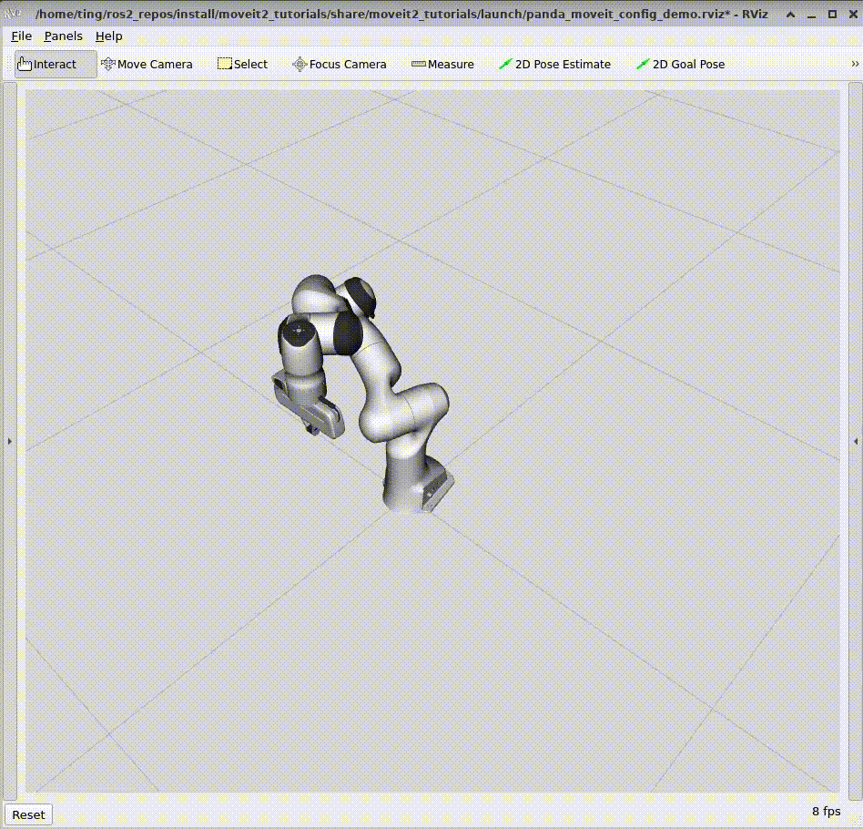
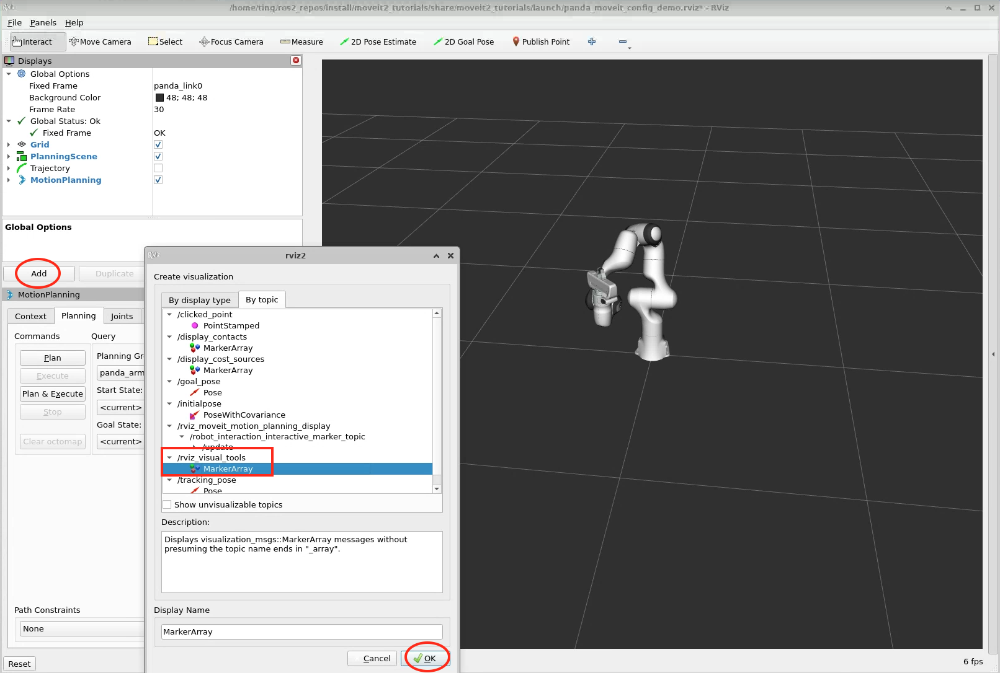

# ros_pose_tracking
ROS2 package for target pose tracking with MoveIt's move group interface framework.
The node listens to the commanding topic /tracking_pose of type geometry_msgs/msg/PoseStamped.
When a commanding topic is received, it plots desired pose first for visulization, then initiates motion planning and execution.

## Setup
- [Humble]  
It seems the node must run on the same machine where MoveIt runs, otherwise certain moveit components may crash.  
"joint trajectory controller" introduces state tolerance check in Humble. As of 11/17/2022, binary distribution on AMD64 for the module is tagged as 2.12.0-1, which may not run properly because of this new tolerance check.  
The most recent source code is tagged as 2.13, which doesn't have this problem. So consider compiling this module from source:  
`https://github.com/ros-controls/ros2_controllers.git/joint_trajectory_controller`

- [Foxy]  
It should build and run out of box.  
Although it runs, it is much more complicated than [Humble] to configure, i.e., it needs launch files, and corresponding robot model parameters explicitly.

## Build (same on both [Humble] and [Foxy])
I used the following command to build, as personal preference, but any colcon command should do:  
`colcon build --symlink-install --cmake-args -DCMAKE_BUILD_TYPE=Release --packages-select ros_pose_tracking --cmake-args=" --log-level=STATUS" --event-handlers console_direct+`

## Run
### 7DOF Panda ARM
#### Start RViz with Moveit
- [Humble]  
[Humble] introduces some significant moveit configuration and launch enhancements.  
If you have moveit2_tutorial package installed, you can directly launch RViz with:  
`ros2 launch moveit2_tutorials demo.launch.py`  
There is no extra step needed. Robot model is automatically published.  
If you don't have moveit2_tutorial package, or if you prefer to use your own config/launch setup, follow the instruction for [Foxy]

- [Foxy]  
Use provided launch script to start Moveit:    
`ros2 launch ros_pose_tracking move_group.panda.launch.py`

#### Start ros_pose_tracking node
- [Humble]  
If you're using moveit2_tutorial package, run the node as:  
`ros2 run ros_pose_tracking ros_pose_tracking`  
If you're using provided launch script, follow the instruction for [Foxy]

- [Foxy]  
`ros2 launch ros_pose_tracking pose_tracking.panda.launch.py`

#### Adding visualization tool's topic to RViz
If you see ros_pose_tracking node emitting message:  
"Topic /rviz_visual_tools waiting 5 seconds for subscriber."  
Don't worry, it is not an error, the following shows how to address it.

ros_pose_tracking node publishes visualization topic to ask RViz to perform visualization rendering. So we need to add this topic in RViz in order to show commanding poses.  

#### Commanding robot ARM to track target poses
Experiments show [Humble] can do any (if not all) motion planning when it operates in ARM's workspace, and meets joint limits requirement.  
But unfortunately it is not the case for [Foxy]. There are couple of instances that motion from pose A to pose B can be performed, but not from pose B back to pose A.  

##### CLI
Here's some of the examples to command pose tracking from shell console:  
`ros2 topic pub /tracking_pose geometry_msgs/msg/PoseStamped '{header: {stamp: {sec: 0, nanosec: 0}, frame_id: "map"}, pose: {position: {x: 0.28, y: -0.2, z: 0.5}, orientation: {x: 0.924135, y: -0.382065, z: -0.00018, w: -0.00048516}}}' -1`

`ros2 topic pub /tracking_pose geometry_msgs/msg/PoseStamped '{header: {stamp: {sec: 0, nanosec: 0}, frame_id: "map"}, pose: {position: {x: 0.28, y: -0.2, z: 0.5}, orientation: {x: 0.0, y: 0.0, z: 0.0, w: 1}}}' -1`

##### Tesing node
You can also run testing code as the following:
- If you're at ros_pose_tracking package's root folder  
`ros2 run ros_pose_tracking ros_pose_tracking_test --ros-args --params-file ros_pose_tracking/config/pose_tracking_test.yaml`
- Or from any where  
`ros2 run ros_pose_tracking ros_pose_tracking_test --ros-args --params-file ``ros2 pkg prefix ros_pose_tracking``/share/ros_pose_tracking/config/pose_tracking_test.yaml`
- Change or add pose data to the following data file to fit your case:  
`ros_pose_tracking/config/pose_tracking_test.yaml`

### Other Robots
- [UR10e]  
All UR10e joints' operating ranges are -360 degree to +360 degree. This provides very fine control for the joint trajectory controller, but it presents a challenge to MoveIt for motion planning, large amount of calculation for extended workspace may prevent finding all potential IK solutions, or a not optimal solution may be selected.

- Make sure adding `ur10e` (either physcal or simulator robot) IP address to your /etc/hosts.

#### Start UR10e or URSim for UR10e
Power the robot or simulator, add (via Program tab) and config (via Installation tab) External Control URCap 

#### Start UR client and controllers
`ros2 launch ur_robot_driver ur_control.launch.py ur_type:=ur10e robot_ip:=localhost launch_rviz:=false initial_joint_controller:=joint_trajectory_controller`   

#### Run External Control URCap
Run external control URCap (via Run button at the botton from Polyscope)

#### Start RViz with Moveit for Physical ARM or URSim

- [Humble]  
Use your preferred moveit config/launch script, but make sure robot model is published by adding the following two extra parameters to move group node:  
`
 'publish_robot_description': True,
 'publish_robot_description_semantic': True,  
`
`ros2 launch ros_pose_tracking humble.ur_moveit.launch.py robot_ip:=ur10e launch_rviz:=true`

#### Start ros_pose_tracking node
Same as Panda ARM, except specifying UR10e move group name:  
`ros2 run ros_pose_tracking ros_pose_tracking -g ur_manipulator`

Always to check if joint trajectory controller is active:  
`ros2 control list_controllers`

If it is not active, activate it via:  
`ros2 control set_controller_state joint_trajectory_controller active`

#### Adding visualization tool's topic to RViz
Same as Panda ARM

#### Commanding robot ARM to track target poses
Same as Panda ARM
